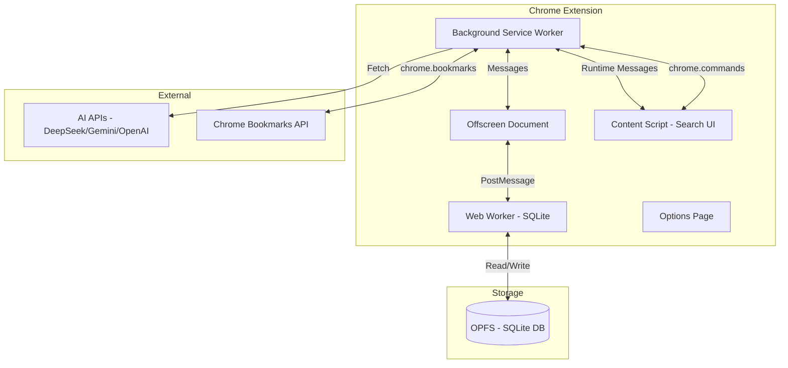

# AI Bookmark Brain - Chrome Extension Implementation Plan

A Chrome extension that scans bookmarks, generates AI summaries using DeepSeek/Gemini/OpenAI APIs, stores data locally with SQLite WASM + OPFS, and provides intelligent global search via Ctrl+Q hotkey.

## User Review Required

> [!IMPORTANT]
> **AI API Keys Required**: You'll need to configure at least one AI provider (DeepSeek, Gemini, or OpenAI-compatible) in the extension settings.

> [!WARNING]
> **Initial Sync Time**: First-time bookmark scanning and AI summarization may take significant time depending on bookmark count and API rate limits.

---

## Technology Stack

| Layer | Technology | Rationale |
|-------|------------|-----------|
| **Framework** | [WXT](https://wxt.dev) (Web Extension Toolkit) | Modern DX, TypeScript-first, auto-manifest generation, hot reload |
| **UI Components** | [Lit](https://lit.dev) Web Components | Lightweight (~5kb), native Shadow DOM encapsulation, reactive templating |
| **Database** | [@sqliteai/sqlite-wasm](https://www.npmjs.com/package/@sqliteai/sqlite-wasm) | Full SQLite wrapper, OPFS persistence, TypeScript support, auto-loaded extensions |
| **Messaging** | [webext-bridge](https://www.npmjs.com/package/webext-bridge) | Type-safe message passing, cross-context targeting, Promise-based |
| **Storage (Settings)** | [@wxt-dev/storage](https://wxt.dev/guide/storage) | WXT built-in, type-safe, versioning & migrations, reactive watchers |
| **Search** | [Fuse.js](https://www.fusejs.io/) + [pinyin-match](https://www.npmjs.com/package/pinyin-match) | Fuzzy search + Chinese pinyin matching |

---

## Architecture Overview



---

## Proposed Changes

### Core Infrastructure

#### [NEW] [wxt.config.ts](file:///h:/22/wxt.config.ts)
WXT configuration with manifest permissions:
- `bookmarks`, `storage`, `offscreen`, `contextMenus`, `activeTab`
- Commands registration for `Ctrl+Q` hotkey
- Build optimization settings

#### [NEW] [src/shared/constants/index.ts](file:///h:/22/src/shared/constants/index.ts)
Global constants registry:
- Database configuration (table names, version)
- API endpoints
- UI constants (colors, dimensions)
- Message types enum

---

### Database Layer (OPFS + SQLite WASM)

> [!TIP]
> Using `@sqliteai/sqlite-wasm` wrapper which provides ES Module compatibility, OPFS persistence, and full TypeScript support out of the box.

#### [NEW] [src/entrypoints/offscreen.html](file:///h:/22/src/entrypoints/offscreen.html)
Minimal HTML document to host Web Worker for SQLite operations.

#### [NEW] [src/entrypoints/offscreen.ts](file:///h:/22/src/entrypoints/offscreen.ts)
Bridge using `webext-bridge` for type-safe messaging:
- Listens for messages from background via `onMessage()`
- Forwards to Web Worker via postMessage
- Returns results with Promise-based response

#### [NEW] [src/workers/database.worker.ts](file:///h:/22/src/workers/database.worker.ts)
SQLite WASM database operations in Web Worker:
- Initialize `@sqliteai/sqlite-wasm` with OPFS persistence
- Execute SQL queries
- Handle CRUD operations for all tables

#### [NEW] [src/database/schema.ts](file:///h:/22/src/database/schema.ts)
Database schema definitions:
```sql
-- bookmarks: id, chrome_id, title, url, favicon_url, parent_folder, created_at, updated_at
-- summaries: id, bookmark_id, ai_provider, summary_text, keywords, embedding (BLOB), created_at
-- categories: id, name, color, user_defined
-- bookmark_categories: bookmark_id, category_id
-- sync_log: id, action, bookmark_id, status, timestamp, error
```

#### [NEW] [src/services/database.service.ts](file:///h:/22/src/services/database.service.ts)
High-level database API with Repository pattern:
- `BookmarkRepository`: CRUD for bookmarks
- `SummaryRepository`: CRUD for AI summaries  
- `CategoryRepository`: CRUD for categories

#### [NEW] [src/lib/storage.ts](file:///h:/22/src/lib/storage.ts)
Settings storage using `@wxt-dev/storage`:
```typescript
import { storage } from '@wxt-dev/storage';

export const apiKeys = storage.defineItem<{ deepseek?: string; gemini?: string; openai?: string }>(
  'local:apiKeys',
  { defaultValue: {} }
);
export const activeProvider = storage.defineItem<string>('local:activeProvider', { defaultValue: 'deepseek' });
export const syncStatus = storage.defineItem<{ lastSync: number; inProgress: boolean }>('local:syncStatus');
```

---

### AI Service Layer

#### [NEW] [src/services/ai/base.ts](file:///h:/22/src/services/ai/base.ts)
Abstract AI service interface:
```typescript
interface AIService {
  summarize(content: { title: string; url: string; body?: string }): Promise<SummaryResult>;
  generateEmbedding?(text: string): Promise<number[]>; // Reserved for cosine similarity
}
```

#### [NEW] [src/services/ai/deepseek.ts](file:///h:/22/src/services/ai/deepseek.ts)
DeepSeek API implementation with:
- Chat completion endpoint
- Customizable summarization prompt
- Rate limiting and retry logic

#### [NEW] [src/services/ai/gemini.ts](file:///h:/22/src/services/ai/gemini.ts)
Gemini API implementation with:
- Google AI SDK integration
- Multi-turn conversation support (reserved)

#### [NEW] [src/services/ai/openai-compatible.ts](file:///h:/22/src/services/ai/openai-compatible.ts)
OpenAI-compatible adapter for custom endpoints:
- Configurable base URL
- Standard chat completion format
- Support for local LLMs (Ollama, LMStudio)

#### [NEW] [src/services/ai/factory.ts](file:///h:/22/src/services/ai/factory.ts)
AI service factory pattern for provider selection based on user settings.

---

### Bookmark Synchronization

#### [NEW] [src/services/sync/bookmark-sync.service.ts](file:///h:/22/src/services/sync/bookmark-sync.service.ts)
Bookmark synchronization logic:
- Listen to `chrome.bookmarks.onCreated/onChanged/onRemoved`
- Full sync on extension install
- Incremental sync on bookmark changes
- Detailed console logging for debugging

#### [NEW] [src/services/sync/summarization-queue.ts](file:///h:/22/src/services/sync/summarization-queue.ts)
Background summarization queue:
- Process bookmarks in batches
- Respect API rate limits
- Skip already summarized bookmarks
- Handle fetch failures gracefully

---

### Search Engine

#### [NEW] [src/services/search/search-engine.ts](file:///h:/22/src/services/search/search-engine.ts)
Multi-strategy search engine:
- **Exact match**: Direct title/URL substring matching (highest priority)
- **Fuzzy match**: Fuse.js for typo tolerance
- **Pinyin match**: pinyin-match for Chinese character input
- **Keyword match**: AI-generated keywords matching
- Weighted scoring and result ranking
- Case-insensitive by default

#### [NEW] [src/services/search/cosine-similarity.ts](file:///h:/22/src/services/search/cosine-similarity.ts)
Reserved interface for embedding-based semantic search:
- cosine similarity calculation
- Integration point for future embedding models

---

### Global Search UI (Lit Web Components)

> [!TIP]
> Using Lit for lightweight (~5kb) Web Components with native Shadow DOM encapsulation. This ensures our UI styles never conflict with the host page.

#### [NEW] [src/entrypoints/content.ts](file:///h:/22/src/entrypoints/content.ts)
Content script entry point:
- Listen for Ctrl+Q command via `webext-bridge` `onMessage()`
- Create/toggle `<bookmark-search-overlay>` Lit component
- All styles encapsulated in Shadow DOM

#### [NEW] [src/ui/components/search-overlay.ts](file:///h:/22/src/ui/components/search-overlay.ts)
Main Lit component (`<bookmark-search-overlay>`):
```typescript
@customElement('bookmark-search-overlay')
export class SearchOverlay extends LitElement {
  static styles = css`/* Windows 10/11 flat design */`;
  @property() visible = false;
  @property() query = '';
  @property() results: BookmarkResult[] = [];
  @property() selectedIndex = 0;
}
```

#### [NEW] [src/ui/components/search-input.ts](file:///h:/22/src/ui/components/search-input.ts)
Search input with embedded filter dropdown (`<search-input>`).

#### [NEW] [src/ui/components/result-item.ts](file:///h:/22/src/ui/components/result-item.ts)
Result item component (`<result-item>`):
- Left: Favicon + Title + URL
- Right: Category badge, selection state

#### [NEW] [src/ui/components/summary-panel.ts](file:///h:/22/src/ui/components/summary-panel.ts)
Resizable AI summary panel (`<summary-panel>`):
- CSS resize: horizontal
- Shows AI summary, keywords, metadata for selected bookmark

#### [NEW] [src/ui/styles/theme.css](file:///h:/22/src/ui/styles/theme.css)
Windows 10/11 flat design system:
- No border-radius (sharp corners)
- `prefers-color-scheme` for dark/light mode
- Compact spacing, Segoe UI font stack

---

### Context Menu Integration

#### [NEW] [src/entrypoints/background.ts](file:///h:/22/src/entrypoints/background.ts)
Background service worker:
- Register context menu on install
- Handle Ctrl+Q command dispatch
- Coordinate offscreen document lifecycle
- Initialize all services on startup

Context menu items:
- "Summarize this page" - Manual page summarization for pages behind login/CF

---

### Settings & Options

#### [NEW] [src/entrypoints/options.html](file:///h:/22/src/entrypoints/options.html)
Options page HTML with flat Windows styling.

#### [NEW] [src/entrypoints/options.ts](file:///h:/22/src/entrypoints/options.ts)
Options page logic:
- AI provider selection and API key input
- Custom categories management
- Sync status and manual trigger
- Update log viewer
- Data export/import

---

## Directory Structure

```
h:/22/
├── wxt.config.ts
├── package.json
├── tsconfig.json
├── src/
│   ├── shared/
│   │   ├── constants/
│   │   │   └── index.ts           # Global constants, message types
│   │   ├── types/
│   │   │   └── index.ts           # TypeScript interfaces
│   │   └── utils/
│   │       └── logger.ts          # Console logging utility
│   ├── entrypoints/
│   │   ├── background.ts          # Service worker
│   │   ├── content.ts             # Content script
│   │   ├── offscreen.html         # Offscreen document
│   │   ├── offscreen.ts
│   │   ├── options.html           # Options page
│   │   └── options.ts
│   ├── workers/
│   │   └── database.worker.ts     # SQLite Web Worker
│   ├── database/
│   │   └── schema.ts              # SQL schema
│   ├── services/
│   │   ├── database.service.ts    # DB abstraction
│   │   ├── ai/
│   │   │   ├── base.ts
│   │   │   ├── deepseek.ts
│   │   │   ├── gemini.ts
│   │   │   ├── openai-compatible.ts
│   │   │   └── factory.ts
│   │   ├── sync/
│   │   │   ├── bookmark-sync.service.ts
│   │   │   └── summarization-queue.ts
│   │   └── search/
│   │       ├── search-engine.ts
│   │       └── cosine-similarity.ts
│   └── ui/
│       └── search-overlay/
│           ├── index.ts
│           ├── styles.css
│           └── components/
│               ├── SearchInput.ts
│               ├── ResultsList.ts
│               ├── ResultItem.ts
│               └── SummaryPanel.ts
└── public/
    └── icons/
        ├── icon-16.png
        ├── icon-32.png
        ├── icon-48.png
        └── icon-128.png
```

---

## Verification Plan

### Automated Tests (Unit)
Since this is a new project, we'll create test infrastructure during development:

1. **Database Layer Tests**
   ```bash
   # Run after implementation
   npm run test:unit
   ```
   - Test SQLite operations in simulated environment
   - Verify CRUD operations for all repositories

2. **Search Engine Tests**
   ```bash
   npm run test:unit -- search-engine
   ```
   - Test exact matching (case-insensitive)
   - Test fuzzy matching with Fuse.js
   - Test pinyin matching
   - Test weighted scoring

### Manual Verification (Browser Testing)

> [!NOTE]
> These tests require loading the extension in Chrome Developer Mode.

1. **Extension Loading**
   - Run `npm run dev` to build and watch
   - Navigate to `chrome://extensions`
   - Enable "Developer mode"
   - Click "Load unpacked" and select `h:\22\.output\chrome-mv3`
   - Verify extension appears with icon

2. **Bookmark Sync**
   - Open DevTools background page console
   - Verify "FULL_SYNC started" log appears
   - Add a new bookmark and verify "Incremental sync" log
   - Check for any error logs

3. **Search UI (Ctrl+Q)**
   - Open any webpage
   - Press Ctrl+Q
   - Verify overlay appears without hiding page content
   - Type search query, verify results appear
   - Use arrow keys to navigate, verify selection changes
   - Press Enter on result, verify new tab opens
   - Press Escape, verify overlay closes
   - Toggle dark/light mode in Chrome settings, verify UI adapts

4. **Context Menu Summarization**
   - Right-click on any page
   - Select "Summarize this page"
   - Verify confirmation/progress appears
   - Check DevTools for summary result

5. **Options Page**
   - Click extension icon → Options
   - Add DeepSeek API key
   - Trigger manual sync
   - Verify sync completes without errors

---

## Risk Mitigation

| Risk | Mitigation |
|------|------------|
| OPFS not available | Fallback to localStorage with size warning |
| AI API rate limits | Exponential backoff, queue with configurable delay |
| Large bookmark sets | Batch processing, progress indicators |
| Page fetch blocked | Graceful skip, manual summary via context menu |
